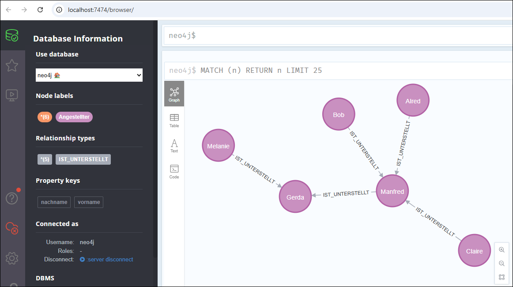

 

Dieser Ordner enthält eine Datei [docker-compose.yml](docker-compose.yml),
mit der eine Neo4j-Instanz in einem Docker-Container gestartet werden kann.

 

[Offiziellen Neo4j-Image auf *Docker Hub*](https://hub.docker.com/_/neo4j/)

 

**Befehle für Lifecycle:**

* Container erzeugen und starten: `docker-compose up`
* Container herunterfahren (aber nicht löschen): `docker-compose stop`
* Container neu starten: `docker-compose start`
* Container herunterfahren und löschen: `docker-compose down`

 

Wenn der Container lokal läuft, dann ist unter der folgenden URL das Web-UI "Neo4j Browser"
erreichbar: http://localhost:7474/
Nutzername und Passwort sind in der [docker-compose.yml](docker-compose.yml) unter
dem Schlüssel `NEO4J_AUTH` definiert.

 

 